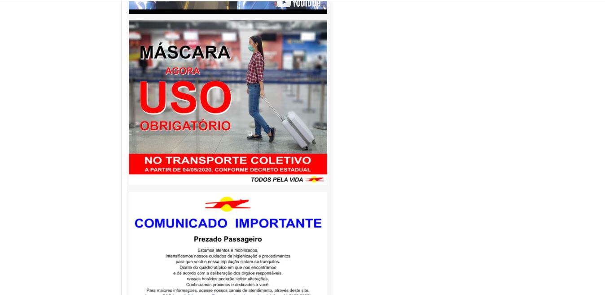
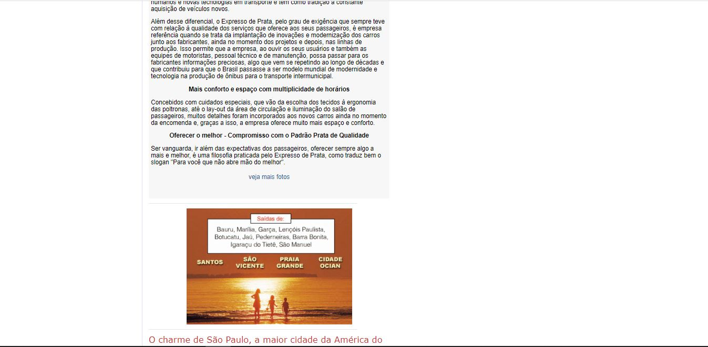
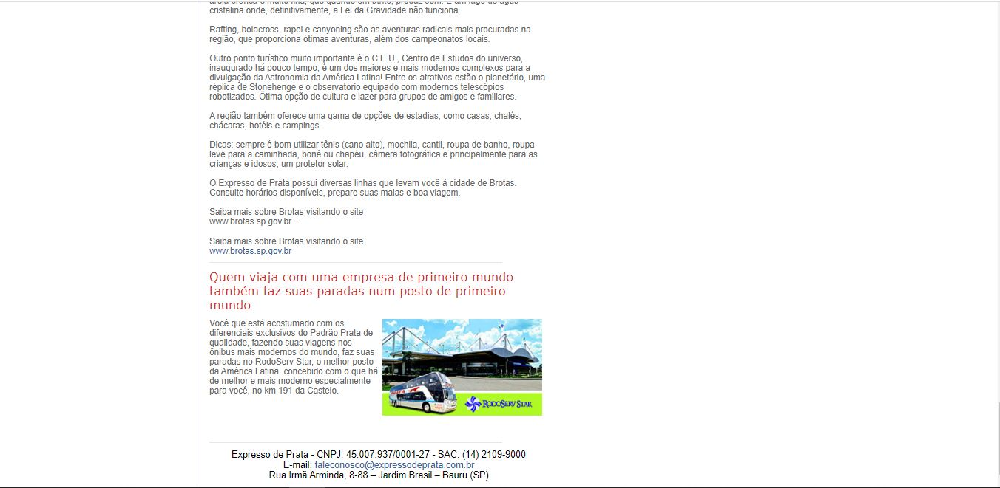
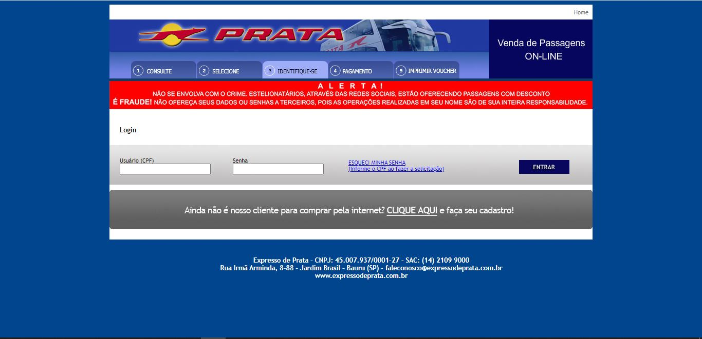

# Projeto-DW1

Amanda Queiroz Carreiro SP3040836 
Marcus Vinicius Rodrigues Dos Santos SP3033279

Projeto da disciplina de Desenvolvimento WEB I do Instituto Federal de São Paulo, com a finalidade de corrigir  problemas de usabilidade de um site segundo a norma ISO 9241-11.

O site escolhido foi o da empresa de ônibus <a href="http://www.expressodeprata.com.br/">Expresso de Prata</a>, sistema a qual tem por objetivo fazer a venda de passagens online.

Os links a seguir juntamente com as respectivas imagens são das telas que foram encontrados problemas de usabilidade e que foram corrigidas: 

<a href="http://www.expressodeprata.com.br/">Home - Página Inicial</a>

<a href="http://www.expressodeprata.com.br/fretamento.php">Fretamento</a>

<a href="http://www.expressodeprata.com.br/empresa.php">Sobre</a>

<a href="https://vendas.expressodeprata.com.br/cgi-bin/br5.cgi?op=hist">Login</a>

<h2>Problemas de usabilidade encontrados</h2>

Capacidade de Leitura: Tamanho da fonte muito pequena, principalmente na tela sobre;

Densidade de informação: Muita informação agrupada na tela inicial;

Experiências dos Usuários: Difícil navegação no sistema;

Compatibilidade: Não há responsividade para diferentes tamanhos de tela;

Ações minímas: Para o usuário encontrar o login é preciso entrar na página passagens, colocando na tela inicial reduz tempo de procura e agiliza a ação

<h2>Correções</h2>

<a href="index.html">Home - Página Inicial</a>

<a href="fretamento.html">Fretamento</a>

<a href="sobre.html">Sobre</a>

<a href="login.html">Acessar sua conta</a>

<a href="mapadosite.html">Mapa do Site</a>

